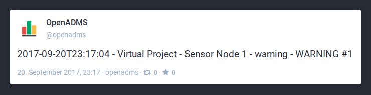

OpenADMS Node Modules
=====================

The logic of the OpenADMS Node software is located in several modules, which are
stored in the directory ``./module/``. New features can be added to the
monitoring system by writing additional modules.  Each module must be loaded
before it can be used.

+-------------------------------------+--------------------------------------------------------+-----+
| **Database**                        |                                                        |     |
+-------------------------------------+--------------------------------------------------------+-----+
| :ref:`couch-driver`                 | Database connectivity for Apache CouchDB.              | 0.6 |
+-------------------------------------+--------------------------------------------------------+-----+
| **Export**                          |                                                        |     |
+-------------------------------------+--------------------------------------------------------+-----+
| :ref:`file-exporter`                | Exports observations to flat files in CSV format.      | 0.3 |
+-------------------------------------+--------------------------------------------------------+-----+
| :ref:`real-time-publisher`          | Distributes observations in real time over a network.  | 0.3 |
+-------------------------------------+--------------------------------------------------------+-----+
| **Linux**                           |                                                        |     |
+-------------------------------------+--------------------------------------------------------+-----+
| :ref:`interrupt-counter`            | Counts interrupts on a GPIO pin of the Raspberry Pi.   | 0.5 |
+-------------------------------------+--------------------------------------------------------+-----+
| **Notification**                    |                                                        |     |
+-------------------------------------+--------------------------------------------------------+-----+
| :ref:`alerter`                      | Collects alert messages.                               | 0.3 |
+-------------------------------------+--------------------------------------------------------+-----+
| :ref:`alert-message-formatter`      | Formats alert messages (e-mail, SMS, IRC, etc.).       | 0.3 |
+-------------------------------------+--------------------------------------------------------+-----+
| :ref:`heartbeat`                    | Broadcasts heartbeat messages.                         | 0.3 |
+-------------------------------------+--------------------------------------------------------+-----+
| :ref:`irc-agent`                    | Sends messages to an Internet Relay Chat network.      | 0.6 |
+-------------------------------------+--------------------------------------------------------+-----+
| :ref:`mail-agent`                   | Sends e-mails via SMTP.                                | 0.3 |
+-------------------------------------+--------------------------------------------------------+-----+
| :ref:`mastodon-agent`               | Sends “toots” to the Mastodon social network.          | 0.6 |
+-------------------------------------+--------------------------------------------------------+-----+
| :ref:`rss-agent`                    | Exports alert messages as RSS feed.                    | 0.6 |
+-------------------------------------+--------------------------------------------------------+-----+
| :ref:`short-message-agent`          | Sends short messages to an TCP/IP-based SMS server.    | 0.3 |
+-------------------------------------+--------------------------------------------------------+-----+
| **Port**                            |                                                        |     |
+-------------------------------------+--------------------------------------------------------+-----+
| :ref:`bluetooth-port`               | Experimental communication with Bluetooth.             | 0.5 |
+-------------------------------------+--------------------------------------------------------+-----+
| :ref:`serial-port`                  | Serial port communication (RS-232/RS-422/RS-485).      | 0.3 |
+-------------------------------------+--------------------------------------------------------+-----+
| **Processing**                      |                                                        |     |
+-------------------------------------+--------------------------------------------------------+-----+
| :ref:`pre-processor`                | Extracts values from raw observation responses.        | 0.3 |
+-------------------------------------+--------------------------------------------------------+-----+
| :ref:`response-value-inspector`     | Validates observation responses.                       | 0.6 |
+-------------------------------------+--------------------------------------------------------+-----+
| :ref:`return-code-inspector`        | Checks the return codes of Leica Geosystems sensors.   | 0.3 |
+-------------------------------------+--------------------------------------------------------+-----+
| :ref:`unit-converter`               | Converts units of observation response values.         | 0.5 |
+-------------------------------------+--------------------------------------------------------+-----+
| **Prototype**                       |                                                        |     |
+-------------------------------------+--------------------------------------------------------+-----+
| :ref:`prototype`                    | Blueprint for new OpenADMS module.                     | 0.3 |
+-------------------------------------+--------------------------------------------------------+-----+
| **Schedule**                        |                                                        |     |
+-------------------------------------+--------------------------------------------------------+-----+
| :ref:`scheduler`                    | General scheduling of observations.                    | 0.3 |
+-------------------------------------+--------------------------------------------------------+-----+
| **Server**                          |                                                        |     |
+-------------------------------------+--------------------------------------------------------+-----+
| :ref:`local-control-server`         | Webserver for simple remote control.                   | 0.5 |
+-------------------------------------+--------------------------------------------------------+-----+
| **Testing**                         |                                                        |     |
+-------------------------------------+--------------------------------------------------------+-----+
| :ref:`error-generator`              | Creates warning, error, and critical log messages.     | 0.6 |
+-------------------------------------+--------------------------------------------------------+-----+
| **Totalstation**                    |                                                        |     |
+-------------------------------------+--------------------------------------------------------+-----+
| :ref:`distance-corrector`           | Removes atmospheric influences from distances.         | 0.3 |
+-------------------------------------+--------------------------------------------------------+-----+
| :ref:`helmert-transformer`          | Free stationing of total stations.                     | 0.3 |
+-------------------------------------+--------------------------------------------------------+-----+
| :ref:`polar-transformer`            | Converts polar coordinates to Cartesian coordinates.   | 0.3 |
+-------------------------------------+--------------------------------------------------------+-----+
| :ref:`refraction-corrector`         | Corrects the atmospheric refraction.                   | 0.4 |
+-------------------------------------+--------------------------------------------------------+-----+
| :ref:`serial-measurement-processor` | Processing of observations in two faces.               | 0.3 |
+-------------------------------------+--------------------------------------------------------+-----+
| **Unix**                            |                                                        |     |
+-------------------------------------+--------------------------------------------------------+-----+
| :ref:`gpio-controller`              | Interacts with the GPIO interface of the Raspberry Pi. | 0.6 |
+-------------------------------------+--------------------------------------------------------+-----+
| **Virtual**                         |                                                        |     |
+-------------------------------------+--------------------------------------------------------+-----+
| :ref:`virtual-dtm`                  | Virtual STS DTM temperature/pressure sensor.           | 0.3 |
+-------------------------------------+--------------------------------------------------------+-----+
| :ref:`virtual-indicator-one`        | Virtual Sylvac S\_Dial One digital indicator.          | 0.3 |
+-------------------------------------+--------------------------------------------------------+-----+
| :ref:`virtual-total-station-tm30`   | Virtual Leica TM30 total station.                      | 0.3 |
+-------------------------------------+--------------------------------------------------------+-----+

Modules can be loaded by adding them to the ``modules`` section of the OpenADMS
Node core configuration. In the example below, the modules :ref:`scheduler` and
:ref:`file-exporter` will be loaded:

.. code:: javascript

    {
      "core":
        "modules": {
          "fileExporter": "modules.export.FileExporter",
          "schedulerCom1": "modules.schedule.Scheduler"
        }
      }
    }

The key ``fileExporter`` sets the name of the instance, the value
``modules.export.FileExporter`` the path to the module (class ``FileExporter``
in ``./modules/export.py``). The name of an instance can be chosen freely. For
instance, instead of ``fileExporter`` the name ``myFileExporter`` is also valid,
but the key of the FileExporter module configuration has to be renamed as well.
Multiple instances of a module are possible, if they have different names (e.g.,
``scheduler1``, ``scheduler2``, and so on). Each instance has its own
configuration.

Database
--------

Drivers for various database management systems are provided in this package.

.. _couch-driver:

CouchDriver
~~~~~~~~~~~

CouchDriver is a connectivity module for `Apache CouchDB`_. It is used to store
observation data sets in a CouchDB database (see :numref:`couchdb`).
Observations send to a CouchDriver instance will be saved in the CouchDB
database defined in the module’s configuration.

.. _couchdb:
.. figure:: _static/couchdb.png
   :alt: An observation data set stored in an Apache CouchDB database

   An observation data set stored in an Apache CouchDB database

Loading the Module
^^^^^^^^^^^^^^^^^^

Add the following line to the ``modules`` section of the configuration file to
load the CouchDriver:

.. code:: javascript

    {
      "modules": {
        "couchDriver": "modules.database.CouchDriver"
      }
    }

Configuration
^^^^^^^^^^^^^

.. code:: javascript

    {
      "couchDriver": {
        "server": "192.168.0.100",
        "port": 5984,
        "tls": false,
        "user": "joe",
        "password": "secret",
        "db": "openadms"
      }
    }

+--------------+-------------+---------------------------------------------------------+
| Name         | Data Type   | Description                                             |
+==============+=============+=========================================================+
| ``server``   | String      | IP address or FQDN of the CouchDB server.               |
+--------------+-------------+---------------------------------------------------------+
| ``port``     | String      | Port number (default is ``5984``).                      |
+--------------+-------------+---------------------------------------------------------+
| ``tls``      | Boolean     | If true, uses encrypted HTTPS instead of HTTP (depends  |
|              |             | on server).                                             |
+--------------+-------------+---------------------------------------------------------+
| ``user``     | String      | Name of the CouchDB user.                               |
+--------------+-------------+---------------------------------------------------------+
| ``password`` | String      | Password of the CouchDB user.                           |
+--------------+-------------+---------------------------------------------------------+
| ``db``       | String      | Name of the CouchDB database.                           |
+--------------+-------------+---------------------------------------------------------+

Export
------

Modules in the *Export* package store observation data locally or forward it to
external receivers.

.. _file-exporter:

FileExporter
~~~~~~~~~~~~

The FileExporter module is used to export observations to comma-separated flat
files. Every file starts with a header, introduced by the character ``#``.
Observations are stored line by line in the file, with new ones appended at the
end.

Each line starts with date and time of the observation, followed by the ID,
target name and all response sets in alphabetical order. The format of date and
time can be modified in the configuration. A response set consists of response
name, response value, and response unit.

Example
^^^^^^^

A single observation in a CSV file, with a header line at the beginning:

.. code:: text

    # Target "EXT" of "Extensometer" on "USB0"
    2016-10-09T15:29:38,6dc84c06018043ba84ac90636ed0f677,EXT,Distance,19.212,mm

+----------+--------------------------------------+------------------------------------------+
| No.      | Value                                | Description                              |
+==========+======================================+==========================================+
| 1        | ``2016-10-09T15:29:38``              | Date and time (ISO 8601).                |
+----------+--------------------------------------+------------------------------------------+
| 2        | ``6dc84c06018043ba84ac90636ed0f677`` | ID of the observation.                   |
+----------+--------------------------------------+------------------------------------------+
| 2        | ``EXT``                              | Target name of the observation.          |
+----------+--------------------------------------+------------------------------------------+
| 3        | ``Distance``                         | Name of the response set.                |
+----------+--------------------------------------+------------------------------------------+
| 4        | ``19.212``                           | Value of the response set.               |
+----------+--------------------------------------+------------------------------------------+
| 5        | ``mm``                               | Unit of the response set.                |
+----------+--------------------------------------+------------------------------------------+

Additional response sets will be appended at the end of the line.

Loading the Module
^^^^^^^^^^^^^^^^^^

Add the FileExporter to the ``modules`` section of the core configuration:

.. code:: javascript

    {
      "modules": {
        "fileExporter": "modules.export.FileExporter"
      }
    }

Configuration
^^^^^^^^^^^^^

.. code:: javascript

    {
      "fileExporter": {
        "fileExtension": ".csv",
        "fileName": "{{port}}_{{target}}_{{date}}",
        "fileRotation": "monthly",
        "paths": [
          "./data",
          "/media/usbstick/backup"
        ],
        "separator": ",",
        "dateTimeFormat": "YYYY-MM-DDTHH:mm:ss.SSSSS",
        "saveObservationId": true
      }
    }

+-----------------------+-------------+-------------------------------------------------+
| Name                  | Data Type   | Description                                     |
+=======================+=============+=================================================+
| ``fileExtension``     | String      | Extension of the CSV file.                      |
+-----------------------+-------------+-------------------------------------------------+
| ``fileName``          | String      | File name with possible placeholders            |
|                       |             | ``{{date}}``, ``{{target}}``, ``{{name}}``,     |
|                       |             | ``{{port}}``.                                   |
+-----------------------+-------------+-------------------------------------------------+
| ``fileRotation``      | String      | File rotation (``none``, ``daily``,             |
|                       |             | ``monthly``, or ``yearly``).                    |
+-----------------------+-------------+-------------------------------------------------+
| ``paths``             | Array       | Paths to save files to (multiple paths          |
|                       |             | possible).                                      |
+-----------------------+-------------+-------------------------------------------------+
| ``separator``         | String      | Separator between values within the CSV file.   |
+-----------------------+-------------+-------------------------------------------------+
| ``dateTimeFormat``    | String      | Format of date and time (see `Arrow tokens`_).  |
+-----------------------+-------------+-------------------------------------------------+
| ``saveObservationId`` | Boolean     | If ``true``, save the ID of each observation.   |
+-----------------------+-------------+-------------------------------------------------+

.. _real-time-publisher:

RealTimePublisher
~~~~~~~~~~~~~~~~~

The RealTimePublisher module pushes an observation to a list of receivers. The
receivers can be any third party application.

For each receiver defined in the configuration an MQTT topic will be created.
The observations are then published under their target names. For example, an
observation with the target name “target1” and a receiver “onlineViewer” will be
published under the MQTT topic ``onlineViewer/target1``.

Loading the Module
^^^^^^^^^^^^^^^^^^

Add the RealTimePublisher to the ``modules`` section of the core configuration:

.. code:: javascript

    {
      "modules": {
        "realTimePublisher": "modules.export.RealTimePublisher"
      }
    }

Configuration
^^^^^^^^^^^^^

.. code:: javascript

    {
      "realTimePublisher": {
        "enabled": true,
        "receivers": [
          "onlineViewer"
        ]
      }
    }

Linux
-----

Modules in this package are only compatible with Linux operating systems. This
can be due to dependencies or system calls that are available on Linux only.
Further restrictions may apply.

.. _interrupt-counter:

InterruptCounter
~~~~~~~~~~~~~~~~

The InterruptCounter counts interrupts on one of the GPIO pins of the Raspberry
Pi single-board computer. This module should be compatible with all Raspberry Pi
models and ARMv6/ARMv7-based Linux operating systems. It is necessary to install
the Python package `RPi.GPIO`_ before using InterruptCounter. Please run:

::

    $ python3 -m pip install RPi.GPIO

Loading the Module
^^^^^^^^^^^^^^^^^^

Add the InterruptCounter to the ``modules`` section of the core configuration:

.. code:: javascript

    {
      "modules": {
        "interruptCounter": "modules.linux.InterruptCounter"
      }
    }

Configuration
^^^^^^^^^^^^^

.. code:: javascript

    {
      "interruptCounter": {
        "gpio": 4,
        "bounceTime": 250,
        "countTime": 60,
        "receiver": "fileExporter",
        "sensorName": "Tipping Spoon"
      }
    }

+------------------+-------------+------------------------------------------------------+
| Name             | Data Type   | Description                                          |
+==================+=============+======================================================+
| ``gpio``         | Integer     | GPIO pin to observe.                                 |
+------------------+-------------+------------------------------------------------------+
| ``bounceTime``   | Integer     | Time to wait after each interrupt to prevent         |
|                  |             | bouncing (in milliseconds).                          |
+------------------+-------------+------------------------------------------------------+
| ``countTime``    | Float       | Collection time (in seconds).                        |
+------------------+-------------+------------------------------------------------------+
| ``receiver``     | String      | Name of the receiving module.                        |
+------------------+-------------+------------------------------------------------------+
| ``sensorName``   | String      | Name of the connected sensor.                        |
+------------------+-------------+------------------------------------------------------+

Notification
------------

.. _alerter:

Alerter
~~~~~~~

The Alerter module captures warning and error messages. The messages are drained
off from the OpenADMS logger and then send to an arbitrary number of
AlertMessageFormatter module. These will format the messages and forward them to
MailAgent, ShortMessageAgent, RssAgent, IrcAgent, or MastodonAgent modules.

The sequences could be:

-  Alerter → AlertMessageFormatter → MailAgent

-  Alerter → AlertMessageFormatter → ShortMessageAgent

-  Alerter → AlertMessageFormatter → RssAgent

-  Alerter → AlertMessageFormatter → IrcAgent

-  Alerter → AlertMessageFormatter → MastodonAgent

Loading the Module
^^^^^^^^^^^^^^^^^^

Add the Alerter to the ``modules`` section of the core configuration:

.. code:: javascript

    {
      "modules": {
        "alerter": "modules.notification.Alerter"
      }
    }

Alert Message Format
^^^^^^^^^^^^^^^^^^^^

The Alerter module forwards the message in a particular JSON-based format with
the type ``alert``. Example:

.. code:: javascript

    [
      {
        "type": "alert"
      },
      {
        "dt": "2017-09-12 21:40:57",
        "level": "error",
        "name": "serialPort",
        "message": "Observation 'getP09' of 'P09': No target detected",
        "receiver": "engineer@example.com"
      }
    ]

+--------------+-------------+---------------------------------------------------------+
| Name         | Data Type   | Description                                             |
+==============+=============+=========================================================+
| ``dt``       | Integer     | Time stamp of the alert message.                        |
+--------------+-------------+---------------------------------------------------------+
| ``level``    | String      | Alert level (``warning``, ``error``, or ``critical``).  |
+--------------+-------------+---------------------------------------------------------+
| ``name``     | String      | Name of the module which sent the message.              |
+--------------+-------------+---------------------------------------------------------+
| ``message``  | String      | Message text.                                           |
+--------------+-------------+---------------------------------------------------------+
| ``receiver`` | String      | Receiver of the message (e.g., e-mail address, phone    |
|              |             | number, IRC channel).                                   |
+--------------+-------------+---------------------------------------------------------+

Configuration
^^^^^^^^^^^^^

.. code:: javascript

    {
      "alerter": {
        "enabled": true,
        "modules": {
          "shortMessageFormatter": {
            "enabled": true,
            "receivers": {
              "error": [
                "+49152 12345678"
              ],
              "critical": [
                "+49178 110010101"
              ]
            }
          },
          "mailFormatter": {
            "enabled": true,
            "receivers": {
              "warning": [
                "warnings@example.com"
              ],
              "error": [
                "engineer@example.com",
                "customer@example.com"
              ]
            }
          }
        }
      }
    }

+---------------+-------------+---------------------------------------------------------+
| Name          | Data Type   | Description                                             |
+===============+=============+=========================================================+
| ``module``    | Dict        | Modules to process alert messages.                      |
+---------------+-------------+---------------------------------------------------------+
| ``enabled``   | Boolean     | Turns forwarding to module on/off.                      |
+---------------+-------------+---------------------------------------------------------+
| ``receivers`` | Dict        | Alert levels and their respective receivers (depend on  |
|               |             | module).                                                |
+---------------+-------------+---------------------------------------------------------+

.. _alert-message-formatter:

AlertMessageFormatter
~~~~~~~~~~~~~~~~~~~~~

The AlertMessageFormatter is used to format alert messages before sending them
to the :ref:`mail-agent`, the :ref:`short-message-agent`, the :ref:`rss-agent`,
or the :ref:`irc-agent`. The style of an e-mail or SMS can be defined by writing
simple templates. Furthermore, the module is capable of caching incoming
messages a certain time, forwarding them as a whole.

Cached alerts will be concatenated in the body of the message, with the same
header and footer. An example e-mail message is:

.. code:: text

    The following incident(s) occurred:

    2017-03-20T02:53:51 - warning - Observation "getP03" of target "P03": Only angle measurement valid, but without full correction (code 1288 in response "rcGetValues1")
    2017-03-20T02:57:55 - error - Observation "getP11" of target "P11": No target detected (code 8710 in response "rcChangeFace")

    Please do not reply as this e-mail was sent from an automated alerting system.

Loading the Module
^^^^^^^^^^^^^^^^^^

Add the AlertMessageFormatter to the ``modules`` section of the core configuration:

.. code:: javascript

    {
      "modules": {
        "alertMessageFormatter": "modules.notification.AlertMessageFormatter"
      }
    }

Configuration
^^^^^^^^^^^^^

Given are two AlertMessageFormatter, ``mailFormatter`` and
``shortMessageFormatter``:

.. code:: javascript

    {
      "modules": {
        "mailFormatter": "modules.notify.AlertMessageFormatter",
        "shortMessageFormatter": "modules.notify.AlertMessageFormatter"
      }
    }

They are used to format e-mails and short messages.

.. code:: javascript

    {
      "mailFormatter": {
        "messageCollectionEnabled": true,
        "messageCollectionTime": 600,
        "receiver": "mailAgent",
        "type": "email",
        "templates": {
          "header": "The following incident(s) occurred:\n\n",
          "body": "{{dt}} - {{level}} - {{message}}\n",
          "footer": "\nPlease do not reply as this e-mail was sent from an automated alerting system."
        },
        "properties": {
          "subject": "[OpenADMS] Alert Message - Project X",
          "from": "OpenADMS",
          "to": "{{receiver}}"
        }
      },
      "shortMessageFormatter": {
        "messageCollectionEnabled": false,
        "messageCollectionTime": 0,
        "receiver": "shortMessageAgent",
        "type": "sms",
        "templates": {
          "header": "<?xml version=\"1.0\"?><cmgs destaddr=\"{{receiver}}\">",
          "body": "{{dt}} - {{level}} - {{message}}",
          "footer": "</cmgs>"
        },
        "properties": {
          "number": "{{receiver}}"
        }
      }
    }

+------------------------------+-------------+----------------------------------------------+
| Name                         | Data Type   | Description                                  |
+==============================+=============+==============================================+
| ``messageCollectionEnabled`` | Boolean     | Collect messages in a cache before sending.  |
+------------------------------+-------------+----------------------------------------------+
| ``messageCollectionTime``    | Float       | Time in seconds to cache messages.           |
+------------------------------+-------------+----------------------------------------------+
| ``receiver``                 | String      | Name of the receiving module.                |
+------------------------------+-------------+----------------------------------------------+
| ``type``                     | String      | Type of the message (e.g., ``email`` or      |
|                              |             | ``sms``).                                    |
+------------------------------+-------------+----------------------------------------------+
| ``templates``                | Dict        | Message templates with ``header``, ``body``, |
|                              |             | and ``footer``.                              |
+------------------------------+-------------+----------------------------------------------+
| ``properties``               | Dict        | Additional properties expected by the        |
|                              |             | receiver.                                    |
+------------------------------+-------------+----------------------------------------------+

The templates ``header``, ``body``, and ``footer`` are parsed for placeholders:

+-------------------------+---------------------------------------------------------+
| Name                    | Description                                             |
+=========================+=========================================================+
| ``{{dt}}``              | Date and time of the log entry.                         |
+-------------------------+---------------------------------------------------------+
| ``{{level}}``           | Log level (``warning``, ``error``, or ``critical``).    |
+-------------------------+---------------------------------------------------------+
| ``{{message}}``         | Log message text.                                       |
+-------------------------+---------------------------------------------------------+
| ``{{nid}}``             | ID of the sensor node.                                  |
+-------------------------+---------------------------------------------------------+
| ``{{node}}``            | Name of the sensor node.                                |
+-------------------------+---------------------------------------------------------+
| ``{{pid}}``             | ID of the project.                                      |
+-------------------------+---------------------------------------------------------+
| ``{{project}}``         | Name of the project.                                    |
+-------------------------+---------------------------------------------------------+

.. _heartbeat:

Heartbeat
~~~~~~~~~

The Heartbeat sends signals periodically in a defined interval to a list of
receivers. The module is used to inform the receivers that the OpenADMS instance
is still alive (see `Wikipedia`_).

Loading the Module
^^^^^^^^^^^^^^^^^^

Add the Heartbeat to the ``modules`` section of the core configuration:

.. code:: javascript

    {
      "modules": {
        "heartbeat": "modules.notification.Heartbeat"
      }
    }

Configuration
^^^^^^^^^^^^^

.. code:: javascript

    {
      "heartbeat": {
        "receivers": ["heartbeat"],
        "interval": 10
      }
    }

+------------------+-------------+------------------------------------------------------+
| Name             | Data Type   | Description                                          |
+==================+=============+======================================================+
| ``receivers``    | List        | List of receivers (topics).                          |
+------------------+-------------+------------------------------------------------------+
| ``interval``     | Integer     | Message sending interval in seconds.                 |
+------------------+-------------+------------------------------------------------------+

.. _irc-agent:

IrcAgent
~~~~~~~~

The IrcAgent connects to an Internet Relay Chat (IRC) server and sends messages
to a given channel or user. The module accepts messages of type ``irc``.

Loading the Module
^^^^^^^^^^^^^^^^^^

Add the IrcAgent to the ``modules`` section of the core configuration:

.. code:: javascript

    {
      "modules": {
        "ircAgent": "modules.notification.IrcAgent"
      }
    }

IRC Message Format
^^^^^^^^^^^^^^^^^^

The messages send to the module have to be structured in JSON format:

.. code:: javascript

    [
      {
        "type": "irc"
      },
      {
        "message": "2017-09-08T11:55:58 - error - preProcessor - No response in observation 'getDistance' of target 'disto'",
        "target": "#mychannel"
      }
    ]

+-------------+-------------+---------------------------------------------------------+
| Name        | Data Type   | Description                                             |
+=============+=============+=========================================================+
| ``message`` | String      | Message text.                                           |
+-------------+-------------+---------------------------------------------------------+
| ``target``  | String      | IRC channel or user to send the message to.             |
+-------------+-------------+---------------------------------------------------------+

Configuration
^^^^^^^^^^^^^

.. code:: javascript

    {
      "ircAgent": {
        "server": "irc.freenode.net",
        "port": 6697,
        "tls": true,
        "nickname": "openadms___",
        "password": "",
        "target": "#flood",
        "channel": "#flood"
      }
    }

+------------------+-------------+------------------------------------------------------+
| Name             | Data Type   | Description                                          |
+==================+=============+======================================================+
| ``server``       | String      | IRC server (IP address or FQDN).                     |
+------------------+-------------+------------------------------------------------------+
| ``port``         | String      | Port number (e.g., ``6667`` for plain or ``6697``    |
|                  |             | for TLS).                                            |
+------------------+-------------+------------------------------------------------------+
| ``tls``          | Boolean     | If ``true``, use TLS-encrypted connection.           |
+------------------+-------------+------------------------------------------------------+
| ``nickname``     | String      | Nickname to register with.                           |
+------------------+-------------+------------------------------------------------------+
| ``password``     | String      | Password of the nickname (optional).                 |
+------------------+-------------+------------------------------------------------------+
| ``target``       | String      | Default target to send messages to (channel or       |
|                  |             | user).                                               |
+------------------+-------------+------------------------------------------------------+
| ``channel``      | String      | Channel to join at start-up (optional).              |
+------------------+-------------+------------------------------------------------------+

Example
^^^^^^^

An :ref:`alerter` instance and an :ref:`alert-message-formatter`
instance can be used to send log messages to an IRC server:

.. code:: javascript

    {
      "modules": {
        "alerter": "modules.notification.Alerter",
        "ircFormatter": "modules.notification.AlertMessageFormatter",
        "ircAgent": "modules.notification.IrcAgent"
      },
      "alerter": {
        "enabled": true,
        "modules": {
          "ircFormatter": {
            "enabled": true,
            "receivers": {
              "warning": [ "#mychannel" ],
              "error": [ "#mychannel" ],
              "critical": [ "#mychannel" ]
            }
          }
        }
      },
      "ircFormatter": {
        "messageCollectionEnabled": false,
        "messageCollectionTime": 0,
        "type": "irc",
        "receiver": "ircAgent",
        "templates": {
          "body": "{{dt}} - {{level}} - {{name}} - {{message}}"
        },
        "properties": {
          "target": "{{receiver}}"
        }
      },
      "ircAgent": {
        "server": "irc.freenode.net",
        "port": 6697,
        "tls": true,
        "nickname": "openadms___",
        "target": "#mychannel",
        "channel": "#mychannel"
      }
    }

The setup can be tested with the :ref:`error-generator` module.

.. _mail-agent:

MailAgent
~~~~~~~~~

The MailAgent is used to send arbitrary messages as e-mails via an SMTP server.
The module expects the messages to be in a particular format, which is described
below.

Loading the Module
^^^^^^^^^^^^^^^^^^

Add the MailAgent to the ``modules`` section of the core configuration:

.. code:: javascript

    {
      "modules": {
        "mailAgent": "modules.notification.MailAgent"
      }
    }

E-Mail Message Format
^^^^^^^^^^^^^^^^^^^^^

The messages have to be structured in JSON format:

.. code:: javascript

    [
      {
        "type": "email"
      },
      {
        "subject": "E-mail subject",
        "from": "OpenADMS",
        "to": "recipient@example.com",
        "message": "Hello, world!"
      }
    ]

+-------------+-------------+---------------------------------------------------------+
| Name        | Data Type   | Description                                             |
+=============+=============+=========================================================+
| ``subject`` | String      | Subject of the e-mail.                                  |
+-------------+-------------+---------------------------------------------------------+
| ``from``    | String      | Sender of the e-mail.                                   |
+-------------+-------------+---------------------------------------------------------+
| ``to``      | String      | Receiver of the e-mail.                                 |
+-------------+-------------+---------------------------------------------------------+
| ``message`` | String      | E-mail text.                                            |
+-------------+-------------+---------------------------------------------------------+

Configuration
^^^^^^^^^^^^^

.. code:: javascript

    {
      "mailAgent": {
        "defaultSubject": "[OpenADMS] Message",
        "charset": "utf-8",
        "userMail": "monitoring@example.com",
        "userName": "monitoring",
        "userPassword": "secret",
        "host": "smtp.example.com",
        "port": 465,
        "tls": true,
        "startTls": false
      }
    }

+--------------------+-------------+------------------------------------------------------+
| Name               | Data Type   | Description                                          |
+====================+=============+======================================================+
| ``defaultSubject`` | Boolean     | Default subject of the e-mail.                       |
+--------------------+-------------+------------------------------------------------------+
| ``charset``        | String      | Charset of the e-mail.                               |
+--------------------+-------------+------------------------------------------------------+
| ``userMail``       | String      | E-mail address of the sender.                        |
+--------------------+-------------+------------------------------------------------------+
| ``userName``       | String      | SMTP login name.                                     |
+--------------------+-------------+------------------------------------------------------+
| ``userPassword``   | String      | SMTP login password.                                 |
+--------------------+-------------+------------------------------------------------------+
| ``host``           | String      | SMTP host (IP address or FQDN).                      |
+--------------------+-------------+------------------------------------------------------+
| ``port``           | Integer     | SMTP port.                                           |
+--------------------+-------------+------------------------------------------------------+
| ``tls``            | Boolean     | If ``true``, use TLS encryption.                     |
+--------------------+-------------+------------------------------------------------------+
| ``startTls``       | Boolean     | If ``true``, use TLS encryption with StartTLS.       |
+--------------------+-------------+------------------------------------------------------+

.. _mastodon-agent:

MastodonAgent
~~~~~~~~~~~~~

The MastodonAgent sends “toots” to the Twitter-like social network `Mastodon`_
(see :numref:`mastodon-screenshot`). You need an account on one of the Mastodon
instances. See `joinmastodon.org`_ for a list of servers. The length of
messages send to the Mastodon network is limited to 500 characters.

Loading the Module
^^^^^^^^^^^^^^^^^^

Add the MastodonAgent to the ``modules`` section of the core configuration:

.. code:: javascript

    {
      "modules": {
        "mastodonAgent": "modules.notification.MastodonAgent"
      }
    }

.. _mastodon-screenshot:

   OpenADMS alert message on Mastodon

Mastodon Message Format
^^^^^^^^^^^^^^^^^^^^^^^

The messages have to be structured in JSON format:

.. code:: javascript

    [
      {
        "type": "mastodon"
      },
      {
        "message": "Hello, world!"
      }
    ]

+-------------+-------------+---------------------------------------------------------+
| Name        | Data Type   | Description                                             |
+=============+=============+=========================================================+
| ``message`` | String      | The text of the “toot” (< 500 characters).              |
+-------------+-------------+---------------------------------------------------------+

Configuration
^^^^^^^^^^^^^

.. code:: javascript

    {
      "mastodonAgent": {
        "email": "mail@example.com",
        "password": "secret",
        "url": "https://mastodon.at"
      }
    }

+------------------+-------------+------------------------------------------------------+
| Name             | Data Type   | Description                                          |
+==================+=============+======================================================+
| ``email``        | String      | E-mail address associated with the Mastodon account. |
+------------------+-------------+------------------------------------------------------+
| ``password``     | String      | Password of the Mastodon account.                    |
+------------------+-------------+------------------------------------------------------+
| ``url``          | String      | URL of the Mastodon instance.                        |
+------------------+-------------+------------------------------------------------------+

Example
^^^^^^^

An :ref:`alerter` instance and an :ref:`alert-message-formatter` instance can be
used to send log messages to the MastodonAgent:

.. code:: javascript

    {
      "modules": {
        "alerter": "modules.notification.Alerter",
        "mastodonFormatter": "modules.notification.AlertMessageFormatter",
        "mastodonAgent": "modules.notification.MastodonAgent"
      },
      "alerter": {
        "enabled": true,
        "modules": {
          "mastodonFormatter": {
            "enabled": true,
            "receivers": {
              "warning": [ "mastodonAgent" ],
              "error": [ "mastodonAgent" ],
              "critical": [ "mastodonAgent" ]
            }
          }
        }
      },
      "mastodonFormatter": {
        "messageCollectionEnabled": false,
        "messageCollectionTime": 0,
        "type": "mastodon",
        "receiver": "mastodonAgent",
        "templates": {
          "body": "{{dt}} - {{project}} - {{node}} - {{name}} - {{level}} - {{message}}"
        },
        "properties": {}
      },
      "mastodonAgent": {
        "email": "mail@example.com",
        "password": "secret",
        "url": "https://mastodon.at"
      }
    }

The setup can be tested with the :ref:`error-generator` module.

.. _rss-agent:

RssAgent
~~~~~~~~

The RssAgent exports messages as an RSS 2.0 feed. Users can subscribe a public
feed to access log messages with a feed reader (see :numref:`rss-android`).
The RSS format is based on XML. The module accepts messages of type ``rss``.

.. _rss-android:
.. figure:: _static/openadms_rss.png
   :alt: RSS feed with alert messages on Android
   :align: center
   :scale: 30%

   RSS feed with alert messages on Android

Loading the Module
^^^^^^^^^^^^^^^^^^

Add the RssAgent to the ``modules`` section of the core configuration:

.. code:: javascript

    {
      "modules": {
        "rssAgent": "modules.notification.RssAgent"
      }
    }

RSS Message Format
^^^^^^^^^^^^^^^^^^

The messages send to the module have to be structured in JSON format:

.. code:: javascript

    [
      {
        "type": "rss"
      },
      {
        "author": "mail@example.com (John Doe)",
        "dt": "2017-09-18T19:55:45.955084+00:00",
        "guid": "urn:uuid:4d8fc364-f3fc-46d5-869b-7a7c1b9c8972",
        "message": "2017-09-18T19:55:42 - error - preProcessor - No response in observation 'getDistance' of target 'disto'",
        "title": "[OpenADMS] Alert Message - Example Project"
      }
    ]

+-------------+-------------+---------------------------------------------------------+
| Name        | Data Type   | Description                                             |
+=============+=============+=========================================================+
| ``author``  | String      | Author of the RSS entry (optional).                     |
+-------------+-------------+---------------------------------------------------------+
| ``dt``      | String      | Date and time of the RSS entry in UTC (optional).       |
+-------------+-------------+---------------------------------------------------------+
| ``guid``    | String      | Globally Unique Identifier (GUID) of the RSS entry      |
|             |             | (optional).                                             |
+-------------+-------------+---------------------------------------------------------+
| ``message`` | String      | Message of the RSS entry.                               |
+-------------+-------------+---------------------------------------------------------+
| ``title``   | String      | Title of the RSS entry (optional).                      |
+-------------+-------------+---------------------------------------------------------+

Configuration
^^^^^^^^^^^^^

.. code:: javascript

    {
      "rssAgent": {
        "author": "mail@example.com (John Doe)",
        "description": "OpenADMS RSS 2.0 Feed - Example Project",
        "filePath": "./feed.rss",
        "language": "en",
        "link": "https://www.example.com/feed.rss",
        "size": 25,
        "title": "OpenADMS Monitoring - Example Project"
      }
    }

+------------------+-------------+------------------------------------------------------+
| Name             | Data Type   | Description                                          |
+==================+=============+======================================================+
| ``author``       | String      | E-mail and name of the author (optional).            |
+------------------+-------------+------------------------------------------------------+
| ``description``  | String      | Description text of the RSS feed.                    |
+------------------+-------------+------------------------------------------------------+
| ``filePath``     | String      | Path of the RSS file.                                |
+------------------+-------------+------------------------------------------------------+
| ``language``     | String      | ISO 639-1 language code (optional).                  |
+------------------+-------------+------------------------------------------------------+
| ``link``         | String      | URL of the RSS feed.                                 |
+------------------+-------------+------------------------------------------------------+
| ``size``         | Integer     | Number of entries in the RSS feed.                   |
+------------------+-------------+------------------------------------------------------+
| ``title``        | String      | Title of the RSS feed.                               |
+------------------+-------------+------------------------------------------------------+

Example
^^^^^^^

An :ref:`alerter` instance and an :ref:`alert-message-formatter` instance can be
used to send log messages to the RssAgent:

.. code:: javascript

    {
      "modules": {
        "alerter": "modules.notification.Alerter",
        "rssFormatter": "modules.notification.AlertMessageFormatter",
        "rssAgent": "modules.notification.RssAgent"
      },
      "alerter": {
        "enabled": true,
        "modules": {
          "rssFormatter": {
            "enabled": true,
            "receivers": {
              "warning": [ "rssAgent" ],
              "error": [ "rssAgent" ],
              "critical": [ "rssAgent" ]
            }
          }
        }
      },
      "rssFormatter": {
        "messageCollectionEnabled": true,
        "messageCollectionTime": 600,
        "type": "rss",
        "receiver": "rssAgent",
        "templates": {
          "header": "<![CDATA[
The following incident(s) occurred on node \"{{node}}\":
\n<ul>\n",
          "body": "<li><code>{{dt}} - {{level}} - {{message}}</code></li>\n",
          "footer": "</ul>]]>"
        },
        "properties": {
          "title": "[OpenADMS] Alert Message - Example Project",
          "author": "mail@example.com (OpenADMS)",
          "link": "http://www.example.com/feed.rss"
        }
      },
      "rssAgent": {
        "author": "mail@example.com (John Doe)",
        "description": "OpenADMS RSS 2.0 Feed - Example Project",
        "filePath": "./feed.rss",
        "language": "en",
        "link": "https://www.example.com/feed.rss",
        "size": 25,
        "title": "OpenADMS Monitoring - Example Project"
      }
    }

The setup can be tested with the :ref:`error-generator` module.

.. _short-message-agent:

ShortMessageAgent
~~~~~~~~~~~~~~~~~

The ShortMessageAgent can be used to establish a socket connection to a
2G/3G/LTE modem/router and sending an XML-based alerting message to it. The
message will then be forwarded by Short Message Service (SMS). The module is
designed for industrial routers of `MC Technologies`_, but should also work with
other socket-based SMS servers.

Loading the Module
^^^^^^^^^^^^^^^^^^

Add the ShortMessageAgent to the ``modules`` section of the core configuration:

.. code:: javascript

    {
      "modules": {
        "shortMessageAgent": "modules.notification.ShortMessageAgent"
      }
    }

SMS Message Format
^^^^^^^^^^^^^^^^^^

The messages have to be structured in JSON format:

.. code:: javascript

    [
      {
        "type": "sms"
      },
      {
        "number": "+49176 012345678",
        "message": "Hello, world!"
      }
    ]

+------------------+-------------+------------------------------------------------------+
| Name             | Data Type   | Description                                          |
+==================+=============+======================================================+
| ``number``       | String      | Phone number of the receiver.                        |
+------------------+-------------+------------------------------------------------------+
| ``message``      | String      | SMS message text.                                    |
+------------------+-------------+------------------------------------------------------+

Configuration
^^^^^^^^^^^^^

.. code:: javascript

    {
      "shortMessageAgent": {
        "host": "10.59.0.40",
        "port": 1432
      }
    }

+------------------+-------------+------------------------------------------------------+
| Name             | Data Type   | Description                                          |
+==================+=============+======================================================+
| ``host``         | String      | Socket host (IP address or FQDN).                    |
+------------------+-------------+------------------------------------------------------+
| ``port``         | Integer     | Socket port.                                         |
+------------------+-------------+------------------------------------------------------+

Port
----

.. _bluetooth-port:

BluetoothPort
~~~~~~~~~~~~~

The BluetoothPort can be used for RFCOMM serial communication. The module
initiates a socket connection to a sensor by using the native Bluetooth support
of Python 3.3. At the moment, the module is experimental and needs further
testing. It may be easier to use the Bluetooth driver to mount the Bluetooth
port as a local serial port.

Loading the Module
^^^^^^^^^^^^^^^^^^

Add the BluetoothPort to the ``modules`` section of the core configuration:

.. code:: javascript

    {
      "modules": {
        "bt3": "modules.port.BluetoothPort"
      }
    }

Configuration
^^^^^^^^^^^^^

The configuration of BluetoothPort modules has to be placed in ``ports`` →
``bluetooth`` → *instance name*, as shown below for the BluetoothPort instance
``bt3``.

.. code:: javascript

    {
      "ports": {
        "bluetooth": {
          "bt3": {
            "port": 3,
            "serverMacAddress": "5D:4F:4E:F4:55:FD"
          }
        }
      }
    }

+----------------------+-------------+-------------------------------------------------+
| Name                 | Data Type   | Description                                     |
+======================+=============+=================================================+
| ``port``             | Integer     | Bluetooth port number.                          |
+----------------------+-------------+-------------------------------------------------+
| ``serverMacAddress`` | String      | MAC address of the Bluetooth server/sensor.     |
+----------------------+-------------+-------------------------------------------------+

.. _serial-port:

SerialPort
~~~~~~~~~~

The SerialPort module is used for the communication with sensors connected to a
serial interface (RS-232, RS-422, or RS-485). The requests defined in the
``requestSets`` dictionary of the observation will be send one after another to
the sensor. The sensor’s responses are then each stored in the corresponding
request set. The SerialPort module also sets the time stamp of the observation
to the moment the last response has been received.

The SerialPort can communicate with an attached sensor either in *active* or
*passive* mode:

active
    The port sends actively commands to a connected sensor in order to receive
    responses (default mode).

passive
    The port listens passively for incoming data of a connected sensor (must be
    activated by an observation).

An observation can demand passive mode by setting its key ``passiveMode`` to
``true``. The passive mode can be left by a further observation with
``passiveMode`` set to ``false``. In passive mode, the serial port module
creates new observations as fast as incoming data from a sensor is received.

Loading the Module
^^^^^^^^^^^^^^^^^^

Add the SerialPort to the ``modules`` section of the core configuration:

.. code:: javascript

    {
      "modules": {
        "com1": "modules.port.SerialPort",
        "com2": "modules.port.SerialPort"
      }
    }

Configuration
^^^^^^^^^^^^^

In contrast to other modules, the configuration of SerialPort modules has to be
placed in ``ports`` → ``serial`` → *instance name*, as shown below for the
SerialPort instances ``com1`` and ``com2``.

.. code:: javascript

    {
      "ports": {
        "serial": {
          "com1": {
            "port": "COM1",
            "baudRate": 9600,
            "byteSize": 8,
            "stopBits": 1,
            "parity": "none",
            "timeout": 2,
            "softwareFlowControl": false,
            "hardwareFlowControl": false,
            "maxAttempts": 1
          },
          "com2": {
            "port": "COM2",
            "baudRate": 4800,
            "byteSize": 7,
            "stopBits": 2,
            "parity": "even",
            "timeout": 2,
            "softwareFlowControl": false,
            "hardwareFlowControl": false,
            "maxAttempts": 1
          }
        }
      }
    }

+-------------------------+-------------+-------------------------------------------------+
| Name                    | Data Type   | Description                                     |
+=========================+=============+=================================================+
| ``port``                | String      | Name of the port (``COMX`` or ``/dev/ttyX``).   |
+-------------------------+-------------+-------------------------------------------------+
| ``baudRate``            | Integer     | Baud rate (e.g., ``4800``, ``9600``, or         |
|                         |             | ``115200``).                                    |
+-------------------------+-------------+-------------------------------------------------+
| ``byteSize``            | Integer     | Start bits, either ``5``, ``6``, ``7``, or      |
|                         |             | ``8``.                                          |
+-------------------------+-------------+-------------------------------------------------+
| ``stopBits``            | Integer     | Stop bits, either ``1`` or ``2``.               |
+-------------------------+-------------+-------------------------------------------------+
| ``parity``              | String      | Parity, either ``none``, ``even``, or ``odd``.  |
+-------------------------+-------------+-------------------------------------------------+
| ``timeout``             | Float       | Timeout in seconds.                             |
+-------------------------+-------------+-------------------------------------------------+
| ``softwareFlowControl`` | Boolean     | XON/XOFF flow control.                          |
+-------------------------+-------------+-------------------------------------------------+
| ``hardwareFlowControl`` | Boolean     | RTS/CTS flow control.                           |
+-------------------------+-------------+-------------------------------------------------+
| ``maxAttempts``         | Integer     | Maximum number of attempts to access the port.  |
+-------------------------+-------------+-------------------------------------------------+

Processing
----------

.. _pre-processor:

PreProcessor
~~~~~~~~~~~~

The PreProcessor module is used to extract values from a raw response of an
observation and convert them to given data types (i.e., from string to integer
or from string to float). Every observation object has both ``requestSets`` and
``responseSets``, with a regular expression stored in the ``response`` of each
request set. In order to extract single values from the raw response, so called
named groups have to be defined within the regular expressions (`more
information`_). The groups are mapped by the PreProcessor module to the
according response sets.

Example
^^^^^^^

The sensor configuration of a fictional extensometer is listed below. The
request set ``getValues`` has the response pattern
``(?P<distance>[-]?\\d\\.\\d+)`` with a named group ``distance`` in it. The
character ``\`` has to be escaped in JSON, therefore it is written as ``\\``.
The fitting response set ``distance`` expects the data type ``float``. Note,
that group name and response set have the very same name (in this case
``distance``).

The value of group ``distance`` is extracted from the (raw) response
``>+25.1203`` by the PreProcessor using the regular expression, converted to
float, and then stored in the corresponding response set ``distance`` by adding
a key ``value`` to the dictionary, containing the actual measurement value
(``25.1203``).

The PreProcessor performs the following steps:

1. Read raw sensor data ``>+25.1203`` from field ``response`` of request set
   ``getValue``.

2. Extract ``+25.1203`` using the regular expression
   ``(?P<distance>[-]?\\d\\.\\d+)``.

3. Convert the string ``+25.1203`` to the float ``25.1203``.

4. Write value ``25.1203`` to response set ``distance``.

The observation data object is then forwarded to the next receiver.

.. code:: javascript

    {
      "sensors": {
        "extensometer": {
          "description": "example of an extensometer",
          "type": "extensometer",
          "observations": [
            {
              "name": "doMeasure",
              "description": "get sensor value",
              "id": "6dc84c06018043ba84ac90636ed0f677",
              "target": "EXT",
              "receivers": [
                "com1",
                "preProcessor"
              ],
              "nextReceiver": 1,
              "enabled": true,
              "onetime": false,
              "requestsOrder": [
                "getValue"
              ],
              "requestSets": {
                "getValue": {
                  "enabled": true,
                  "request": "?\r",
                  "response": ">+25.1203",
                  "responseDelimiter": "\r",
                  "responsePattern": "(?P<distance>[+-]?\\d+\\.\\d+)",
                  "sleepTime": 0,
                  "timeout": 1
                }
              },
              "responseSets": {
                "distance": {
                  "type": "float",
                  "value": "25.1203",
                  "unit": "mm"
                }
              },
              "sleepTime": 1
            }
          ]
        }
      }
    }

Loading the Module
^^^^^^^^^^^^^^^^^^

Add the PreProcessor to the ``modules`` section of the core configuration:

.. code:: javascript

    {
      "modules": {
        "preProcessor": "modules.processing.PreProcessor"
      }
    }

Configuration
^^^^^^^^^^^^^

The module PreProcessor has nothing to configure.

.. _response-value-inspector:

ResponseValueInspector
~~~~~~~~~~~~~~~~~~~~~~

The ResponseValueInspector checks if response values of observations are within
defined thresholds. It works by checking received observations against the
allowed minimum and maximum values of responses defined in the configuration. A
log messages of level “critical” will be raised if a response value deceeds the
minimum or exceeds the maximum.

Example
^^^^^^^

The response ``slopeDist`` of an arbitrary observation ``getDistance`` should be
between definied lower and upper boundaries. The minimum distance allowed is 2.0
m, the maximum is 300.0 m. Add the name of the observation to the configuration
of the module and set the ``min`` and ``max`` values of the response
``slopeDist`` to the designated values:

.. code:: javascript

    {
      "responseValueInspector": {
        "observations": {
          "getDistance": {
            "slopeDist": {
              "min": 2.0,
              "max": 300.0
            }
          }
        }
      }
    }

The ResponseValueInspector can be used to watch directions, angles, and other
numerical values (integer or float) as well.

Loading the Module
^^^^^^^^^^^^^^^^^^

Add the ResponseValueInspector to the ``modules`` section of the core configuration:

.. code:: javascript

    {
      "modules": {
        "responseValueInspector": "modules.processing.ResponseValueInspector"
      }
    }

Configuration
^^^^^^^^^^^^^

.. code:: javascript

    {
      "responseValueInspector": {
        "observations": {
          "<observationName>": {
            "<responseName>": {
              "min": 20.0,
              "max": 300.0
            }
          }
        }
      }
    }

+------------------+-------------+------------------------------------------------------+
| Name             | Data Type   | Description                                          |
+==================+=============+======================================================+
| ``observations`` | Dict        | Observations with response names and there minimum   |
|                  |             | and maximum values.                                  |
+------------------+-------------+------------------------------------------------------+
| ``min``          | Float       | Minimum value of the response.                       |
+------------------+-------------+------------------------------------------------------+
| ``max``          | Float       | Maximum value of the response.                       |
+------------------+-------------+------------------------------------------------------+

.. _return-code-inspector:

ReturnCodeInspector
~~~~~~~~~~~~~~~~~~~

The ReturnCodeInspector module generates log messages out of responses of
sensors of Leica Geosystems. Generally, every response of a sensor of Leica
Geosystem contains a so called *return code*, a decimal number which reveals
further information about the sensor or the measurement.

The return codes and their descriptions are hard-coded into the module, as well
as the log level (debug, info, warning, error, critical) and the setting whether
or not a failed measurement should be repeated. The number of retries and the
names of return code response sets can be defined in the configuration.

Example
^^^^^^^

In the example below, an observation of a total station is listed. The response
pattern of the request set ``getSensorId`` contains a named group
``returnCode``, which will be mapped to the corresponding response set
``returnCode`` by the PreProcessor module. The ReturnCodeInspector checks the
response sets with the key ``returnCode``. If the return code is greater ``0``
it will generate a log message.

.. code:: javascript

    {
      "name": "initialize",
      "description": "initialize the sensor",
      "receivers": [
        "preProcessor",
        "returnCodeInspector"
      ],
      "nextReceiver": 0,
      "enabled": true,
      "onetime": true,
      "sleepTime": 5,
      "target": "init",
      "requestSets": {
        "getSensorId": {
          "enabled": true,
          "request": "%R1Q,5003:\r\n",
          "responsePattern": "(?:%R1P,0,0:)(?P<returnCode>\\d+)(?:,(?P<sensorId>\\d+))?",
          "responseDelimiter": "\r\n",
          "sleepTime": 0.5,
          "timeout": 30
        }
      },
      "requestsOrder": [
        "getSensorId"
      ],
      "responseSets": {
        "returnCode": {
          "type": "integer",
          "unit": "none",
          "value": 7
        },
        "sensorId": {
          "type": "string",
          "unit": "none",
          "value": 9999999
        }
      }
    }

Loading the Module
^^^^^^^^^^^^^^^^^^

Add the ReturnCodeInspector to the ``modules`` section of the core configuration:

.. code:: javascript

    {
      "modules": {
        "returnCodeInspector": "modules.processing.ReturnCodeInspector"
      }
    }

Configuration
^^^^^^^^^^^^^

.. code:: javascript

    {
      "returnCodeInspector": {
        "retries": 3,
        "responseSets": [
          "returnCode",
          "returnCodeSetDirection"
        ]
      }
    }

+------------------+-------------+-------------------------------------------------------+
| Name             | Data Type   | Description                                           |
+==================+=============+=======================================================+
| ``retries``      | Integer     | Number of retries after a failed observation.         |
+------------------+-------------+-------------------------------------------------------+
| ``responseSets`` | List        | List of return code response set names to search for. |
+------------------+-------------+-------------------------------------------------------+

.. _unit-converter:

UnitConverter
~~~~~~~~~~~~~

The UnitConverter module can be used to convert observation values from one unit
to another. For instance, a given distance in millimetres can be converted to
metres by scaling it with the factor ``0.001``. Add a definition to the
configuration of the module for each response you want to convert. The name of
the response is used as an identifier in the configuration.

Loading the Module
^^^^^^^^^^^^^^^^^^

Add the UnitConverter to the ``modules`` section of the core configuration:

.. code:: javascript

    {
      "modules": {
        "unitConverter": "modules.processing.UnitConverter"
      }
    }

Configuration
^^^^^^^^^^^^^

The configuration below shows the definition of a unit conversion from ``mm`` to
``m`` for a response set with the name ``slopeDist``.

.. code:: javascript

    {
      "unitConverter": {
        "slopeDist": {
          "conversionType": "scale",
          "sourceUnit": "mm",
          "scalingValue": 0.01,
          "targetUnit": "m"
        }
      }
    }

+--------------------+-------------+------------------------------------------------------+
| Name               | Data Type   | Description                                          |
+====================+=============+======================================================+
| ``conversionType`` | String      | Currently, only the conversion type ``scale`` is     |
|                    |             | supported.                                           |
+--------------------+-------------+------------------------------------------------------+
| ``sourceUnit``     | String      | Unit of the source value (e.g., ``mm``).             |
+--------------------+-------------+------------------------------------------------------+
| ``scalingValue``   | Float       | Scaling value (e.g., ``0.1`` or ``1000.0``).         |
+--------------------+-------------+------------------------------------------------------+
| ``targetUnit``     | String      | New unit of the result value (e.g., ``m``).          |
+--------------------+-------------+------------------------------------------------------+

Prototype
---------

All modules are a subclass of the module ``Prototype``.

.. _prototype:

Prototype
~~~~~~~~~

.. note::

    This section is still under construction.

Schedule
--------

.. _scheduler:

Scheduler
~~~~~~~~~

The Scheduler module coordinates the monitoring process by following a schedule
with start and end time to send observations to a defined sensor. It is
mandatory to create a scheduler for each (serial) port instance to start a
deformation monitoring.

The Scheduler works as a facilitator between the sensor and the port.
Observations of a sensor listed in ``observations`` are send one by one to the
bind port instance, using the according schedule.

Loading the Module
^^^^^^^^^^^^^^^^^^

Add the Scheduler to the ``modules`` section of the core configuration:

.. code:: javascript

    {
      "modules": {
        "schedulerCom1": "modules.schedule.Scheduler",
        "schedulerCom2": "modules.schedule.Scheduler"
      }
    }

The name of each instance can be chosen freely.

Configuration
^^^^^^^^^^^^^

Schedulers are configured separately in the ``schedulers`` section of the
configuration, defined by the name of the respective module instance (e.g.,
``schedulerCom1``, ``schedulerCom2``, and so on).

.. code:: javascript

    {
      "schedulers": {
        "schedulerCom1": {
          "port": "com1",
          "sensor": "leicaTm30",
          "schedules": [
            {
              "enabled": true,
              "startDate": "2016-02-01",
              "endDate": "2017-07-30",
              "weekdays": {
                "monday": [
                  {
                    "startTime": "00:00:00",
                    "endTime": "08:00:00"
                  },
                  {
                    "startTime": "10:00:00",
                    "endTime": "23:59:59"
                  }
                ],
                "tuesday": [],
                "wednesday": [],
                "thursday": [],
                "friday": [],
                "saturday": [],
                "sunday": []
              },
              "observations": [
                "doInit",
                "getTargetP1",
                "getTargetP2",
                "getTargetP3"
              ]
            }
          ]
        },
        "schedulerCom2": {
          "port": "com2",
          "sensor": "stsDtm",
          "schedules": [
            {
              "enabled": true,
              "startDate": "2016-02-01",
              "endDate": "2017-07-30",
              "weekdays": {},
              "observations": [
                "getValues"
              ]
            }
          ]
        }
      }
    }

+------------------+-------------+------------------------------------------------------+
| Name             | Data Type   | Description                                          |
+==================+=============+======================================================+
| ``port``         | String      | Name of the port module instance (e.g., ``com1``).   |
+------------------+-------------+------------------------------------------------------+
| ``sensor``       | String      | Name of the sensor as defined in ``sensors``.        |
+------------------+-------------+------------------------------------------------------+
| ``schedules``    | List        | List of schedules.                                   |
+------------------+-------------+------------------------------------------------------+

Server
------

.. _local-control-server:

LocalControlServer
~~~~~~~~~~~~~~~~~~

The LocalControlServer provides a simple web-based user interface for remote
control that can be accessed with a browser (see :numref:`lcs`). The module shows
some project information, system parameters, loaded modules, used sensors, and
log messages.

.. warning::

    The web interface does not feature any kind of authentification or password
    protection. For public Internet access it is recommended to use a reverse
    proxy server, like Nginx or Hiawatha.

.. _lcs:
.. figure:: _static/localcontrolserver.png
   :alt: The web-based user interface of the LocalControlServer

   The web-based user interface of the LocalControlServer

Loading the Module
^^^^^^^^^^^^^^^^^^

Add the LocalControlServer to the ``modules`` section of the core configuration:

.. code:: javascript

    {
      "modules": {
        "localControlServer": "modules.server.LocalControlServer"
      }
    }

Configuration
^^^^^^^^^^^^^

.. code:: javascript

    {
      "localControlServer": {
        "host": "127.0.0.1",
        "port": 8080
      }
    }

+----------+-------------+--------------------------------------------------------------+
| Name     | Data Type   | Description                                                  |
+==========+=============+==============================================================+
| ``host`` | String      | FQDN or IP address. Use a public IP or ``0.0.0.0`` if the    |
|          |             | server should be accessible from outside.                    |
+----------+-------------+--------------------------------------------------------------+
| ``port`` | Integer     | Port number (e.g., ``80`` or ``8080``).                      |
+----------+-------------+--------------------------------------------------------------+

Testing
-------

Modules in this package are used to test the monitoring system.

.. _error-generator:

ErrorGenerator
~~~~~~~~~~~~~~

The ErrorGenerator creates log messages in a set interval. The module can be
used to test the processing of warning, error, and critical log messages.

Loading the Module
^^^^^^^^^^^^^^^^^^

Add the ErrorGenerator to the ``modules`` section of the core configuration:

.. code:: javascript

    {
      "modules": {
        "errorGenerator": "modules.testing.ErrorGenerator"
      }
    }

Configuration
^^^^^^^^^^^^^

.. code:: javascript

    {
      "errorGenerator": {
        "warning": true,
        "error": false,
        "critical": false,
        "interval": 30
      }
    }

+------------------+-------------+------------------------------------------------------+
| Name             | Data Type   | Description                                          |
+==================+=============+======================================================+
| ``warning``      | Boolean     | Turns log messages of level “warning” on or off.     |
+------------------+-------------+------------------------------------------------------+
| ``error``        | Boolean     | Turns log messages of level “error” on or off.       |
+------------------+-------------+------------------------------------------------------+
| ``critical``     | Boolean     | Turns log messages of level “critical” on or off.    |
+------------------+-------------+------------------------------------------------------+
| ``interval``     | Float       | Interval in which new log messages are generated.    |
+------------------+-------------+------------------------------------------------------+

Totalstation
------------

.. _distance-corrector:

DistanceCorrector
~~~~~~~~~~~~~~~~~

The DistanceCorrector module applies atmospheric and sea level reductions to
measured EDM distances of total stations.

The atmospheric correction uses temperature, pressure, and humidity to calculate
the reduced distance. The values can be updated by sending observations of a
weather station to the DistanceCorrector. The response sets must have the names
``temperature``, ``pressure``, and ``humidity`` to be noticed by the module. The
calculated atmospheric PPM value is stored in the response set
``atmosphericPpm`` of the observation.

The sea level correction reduces the distance to sealevel (0 m). The calculated
sea level delta value is stored in the response set ``seaLevelDelta`` of the
observation.

The name of the response set of the distance can be set in the configuration.
The raw distance is moved to a new response set with the postfix ``Raw`` (e.g.,
the raw response set ``slopeDist`` is moved to ``slopeDistRaw``). The original
response set gets overwritten by the corrected value (``slopeDist`` then stores
the corrected distance).

Loading the Module
^^^^^^^^^^^^^^^^^^

Add the DistanceCorrector to the ``modules`` section of the core configuration:

.. code:: javascript

    {
      "modules": {
        "distanceCorrector": "modules.totalstation.DistanceCorrector"
      }
    }

Configuration
^^^^^^^^^^^^^

.. code:: javascript

    {
      "distanceCorrector": {
        "distanceName": "slopeDist",
        "temperature": 20.0,
        "pressure": 1010.0,
        "humidity": 0.6,
        "atmosphericCorrectionEnabled": true,
        "seaLevelCorrectionEnabled": false,
        "sensorHeight": 100.0,
      }
    }

+----------------------------------+-------------+-----------------------------------------------+
| Name                             | Data Type   | Description                                   |
+==================================+=============+===============================================+
| ``distanceName``                 | String      | Name of the response set of the raw distance. |
+----------------------------------+-------------+-----------------------------------------------+
| ``temperature``                  | Float       | Default temperature in °C.                    |
+----------------------------------+-------------+-----------------------------------------------+
| ``pressure``                     | Float       | Default pressure in mbar/hPa.                 |
+----------------------------------+-------------+-----------------------------------------------+
| ``humidity``                     | Float       | Default humidity between ``0.0`` and ``1.0``. |
+----------------------------------+-------------+-----------------------------------------------+
| ``atmosphericCorrectionEnabled`` | Boolean     | Enables atmospheric correction of distances.  |
+----------------------------------+-------------+-----------------------------------------------+
| ``seaLevelCorrectionEnabled``    | Boolean     | Enables sea level reduction of distances.     |
+----------------------------------+-------------+-----------------------------------------------+
| ``sensorHeight``                 | Float       | Sensor height for sealevel reduction.         |
+----------------------------------+-------------+-----------------------------------------------+

.. _helmert-transformer:

HelmertTransformer
~~~~~~~~~~~~~~~~~~

The HelmertTransformer module does a distortion-free seven-parameter
transformation from one datum to another in order to calculate the view point of
a total station and the coordiantes of observed target points. The coordinates
of the fixed points must be defined in the configuration.

An observation will be created for the view point and send to a list of
receivers. The calculated coordinates of the target points are stored as
response sets in the observations (``x``, ``y``, and ``z``).

.. note::

    Please be aware that the keys of the fixed points defined in the dictionary
    ``fixedPoints`` must match the target names of the actual fixed points
    observed by the total station. Otherwise, an assignment between them is not
    possible.

Loading the Module
^^^^^^^^^^^^^^^^^^

Add the HelmertTransformer to the ``modules`` section of the core configuration:

.. code:: javascript

    {
      "modules": {
        "helmertTransformer": "modules.totalstation.HelmertTransformer"
      }
    }

Configuration
^^^^^^^^^^^^^

.. code:: javascript

    {
      "helmertTransformer": {
        "residualMismatchTransformationEnabled": true,
        "viewPoint": {
          "target": "p6",
          "receivers": [
            "fileExporter"
          ]
        },
        "fixedPoints": {
          "p1": {
            "x": 2000,
            "y": 1000,
            "z": 100
          },
          "p2": {
            "x": 1995.488,
            "y": 1003.768,
            "z": 100.008
          },
          "p3": {
            "x": 1994.49,
            "y": 996.26,
            "z": 100.021
          }
        }
      }
    }

+-------------------------------------------+-------------+------------------------------------------------------+
| Name                                      | Data Type   | Description                                          |
+===========================================+=============+======================================================+
| ``residualMismatchTransformationEnabled`` | Boolean     | Prorate residuals between the target points.         |
+-------------------------------------------+-------------+------------------------------------------------------+
| ``viewPoint``                             | Dict        | Target names and receivers of the view point.        |
+-------------------------------------------+-------------+------------------------------------------------------+
| ``fixedPoints``                           | Dict        | Target names and coordinates of the fixed points.    |
+-------------------------------------------+-------------+------------------------------------------------------+

.. _polar-transformer:

PolarTransformer
~~~~~~~~~~~~~~~~

The PolarTransformer module is used to calculate polar coordinates from
Cartesian coordinates. The position of the sensor and the azimuth must be
defined in the configuration. The coordinates of a target point (``x``, ``y``,
and ``z``) are calculated by using trigonometric functions and then saved as
response sets in the observation.

Loading the Module
^^^^^^^^^^^^^^^^^^

Add the PolarTransformer to the ``modules`` section of the core configuration:

.. code:: javascript

    {
      "modules": {
        "polarTransformer": "modules.totalstation.PolarTransformer"
      }
    }

Configuration
^^^^^^^^^^^^^

.. code:: javascript

    {
      "polarTransformer": {
        "viewPoint": {
          "x": 2000,
          "y": 992.51,
          "z": 100
        },
        "fixedPoints": {
          "p1": {
            "x": 2000,
            "y": 1000,
            "z": 100
          },
          "p2": {
            "x": 1995.488,
            "y": 1003.768,
            "z": 100.008
          },
          "p3": {
            "x": 1994.49,
            "y": 996.26,
            "z": 100.021
          }
        },
        "azimuthPointName": "p1",
        "azimuthAngle": 100,
        "adjustmentEnabled": true
      }
    }

+-----------------------+-------------+-------------------------------------------------+
| Name                  | Data Type   | Description                                     |
+=======================+=============+=================================================+
| ``viewPoint``         | Dict        | Coordinates of the sensor position (``x``,      |
|                       |             | ``y``, ``z``).                                  |
+-----------------------+-------------+-------------------------------------------------+
| ``fixedPoints``       | Dict        | Coordinates of the fixed points (``x``, ``y``,  |
|                       |             | ``z``).                                         |
+-----------------------+-------------+-------------------------------------------------+
| ``azimuthPointName``  | Dict        | Name of the fixed point that sets the azimuth.  |
+-----------------------+-------------+-------------------------------------------------+
| ``azimuthAngle``      | Dict        | Global azimuth in gon. Set to ``0`` if no       |
|                       |             | global coordinate system is used.               |
+-----------------------+-------------+-------------------------------------------------+
| ``adjustmentEnabled`` | Dict        | Turns the adjustment of the orientation using   |
|                       |             | more than one fixed point on or off (in German: |
|                       |             | *Abriss*).                                      |
+-----------------------+-------------+-------------------------------------------------+

.. _refraction-corrector:

RefractionCorrector
~~~~~~~~~~~~~~~~~~~

RefractionCorrector removes the influence of the refraction from a measured
distance and corrects the Z value of an observed target.

Loading the Module
^^^^^^^^^^^^^^^^^^

Add the RefractionCorrector to the ``modules`` section of the core configuration:

.. code:: javascript

    {
      "modules": {
        "refractionCorrector": "modules.totalstation.RefractionCorrector"
      }
    }

Configuration
^^^^^^^^^^^^^

The module RefractionCorrector has nothing to configure.

.. _serial-measurement-processor:

SerialMeasurementProcessor
~~~~~~~~~~~~~~~~~~~~~~~~~~

The SerialMeasurementProcessor is used for total station observations in two
faces. The response sets of the first face have to be named ``hz0``, ``v0``, and
``slopeDist0``, whereas the response sets of the second face must be ``hz1``,
``v1``, and ``slopeDist1``. The module creates a new response set inside the
observation object for each arithmetically averaged value (named ``hz``, ``v``,
and ``slopeDist``).

An appropriate requests order is necessary for a measurement in two faces:

1. Set the direction to the target.
2. Do measure in face 0.
3. Get the measured values (``hz0``, ``v0``, ``slopeDist0``, etc.).
4. Change the total station to face 1.
5. Do measure face 1.
6. Get the measured values (``hz1``, ``v1``, ``slopeDist1``, etc.).
7. Change the total station back to face 0.

Example
^^^^^^^

The example shows a measurement with the Leica TM30 total station in two faces.
Both measurements, in face 1 and face 2, are done in one observation, with
response sets for each face.

.. code:: javascript

    {
      "name": "getP1",
      "target": "p1",
      "description": "complete measurement of P1",
      "enabled": true,
      "nextReceiver": 0,
      "onetime": false,
      "receivers": [
        "preProcessor",
        "returnCodeInspector",
        "serialMeasurementProcessor",
        "distanceCorrector",
        "polarTransformer",
        "fileExporter"
      ],
      "requestSets": {
        "changeFace": {
          "enabled": true,
          "request": "%R1Q,9028:1,1,0\r\n",
          "responseDelimiter": "\r\n",
          "responsePattern": "(?:%R1P,0,0:)(?P<rcChangeFace>\\d+)",
          "sleepTime": 0,
          "timeout": 30
        },
        "getFace0": {
          "enabled": true,
          "request": "%R1Q,2026:\r\n",
          "responseDelimiter": "\r\n",
          "responsePattern": "(?:%R1P,0,0:)(?P<rcGetFace0>\\d+)(?:,(?P<face0>\\d+))?",
          "sleepTime": 0,
          "timeout": 30
        },
        "getFace1": {
          "enabled": true,
          "request": "%R1Q,2026:\r\n",
          "responseDelimiter": "\r\n",
          "responsePattern": "(?:%R1P,0,0:)(?P<rcGetFace1>\\d+)(?:,(?P<face1>\\d+))?",
          "sleepTime": 0,
          "timeout": 30
        },
        "getValuesFace0": {
          "enabled": true,
          "request": "%R1Q,2167:5000,1\r\n",
          "responseDelimiter": "\r\n",
          "responsePattern": "(?:%R1P,0,0:)(?P<rcGetValues0>\\d+)(?:,(?P<hz0>\\d*\\.?\\d+),(?P<v0>\\d*\\.?\\d+),(?P<accAngle0>-?\\d*\\.?\\d+),(?P<c0>-?\\d*\\.?\\d*),(?P<l0>-?\\d*\\.?\\d*),(?P<accIncl0>-?\\d*\\.?\\d*),(?P<slopeDist0>\\d*\\.?\\d*),(?P<distTime0>-?\\d*))?",
          "sleepTime": 0,
          "timeout": 30
        },
        "getValuesFace1": {
          "enabled": true,
          "request": "%R1Q,2167:5000,1\r\n",
          "responseDelimiter": "\r\n",
          "responsePattern": "(?:%R1P,0,0:)(?P<rcGetValues1>\\d+)(?:,(?P<hz1>\\d*\\.?\\d+),(?P<v1>\\d*\\.?\\d+),(?P<accAngle1>-?\\d*\\.?\\d+),(?P<c1>-?\\d*\\.?\\d*),(?P<l1>-?\\d*\\.?\\d*),(?P<accIncl1>-?\\d*\\.?\\d*),(?P<slopeDist1>\\d*\\.?\\d*),(?P<distTime1>-?\\d*))?",
          "sleepTime": 0,
          "timeout": 30
        },
        "measureDistanceFace0": {
          "enabled": true,
          "request": "%R1Q,2008:1,1\r\n",
          "responseDelimiter": "\r\n",
          "responsePattern": "(?:%R1P,0,0:)(?P<rcMeasureDistance0>\\d+)",
          "sleepTime": 0,
          "timeout": 30
        },
        "measureDistanceFace1": {
          "enabled": true,
          "request": "%R1Q,2008:1,1\r\n",
          "responseDelimiter": "\r\n",
          "responsePattern": "(?:%R1P,0,0:)(?P<rcMeasureDistance1>\\d+)",
          "sleepTime": 0,
          "timeout": 30
        },
        "setDirection": {
          "enabled": true,
          "request": "%R1Q,9027:0.0,1.59115,2,1,0\r\n",
          "responseDelimiter": "\r\n",
          "responsePattern": "(?:%R1P,0,0:)(?P<rcSetDirection>\\d+)",
          "sleepTime": 2,
          "timeout": 30
        }
      },
      "requestsOrder": [
        "setDirection",
        "getFace0",
        "measureDistanceFace0",
        "getValuesFace0",
        "changeFace",
        "getFace1",
        "measureDistanceFace1",
        "getValuesFace1",
        "changeFace"
      ],
      "responseSets": {
        "accAngle0": {
          "type": "float",
          "unit": "rad"
        },
        "accAngle1": {
          "type": "float",
          "unit": "rad"
        },
        "accIncl0": {
          "type": "float",
          "unit": "rad"
        },
        "accIncl1": {
          "type": "float",
          "unit": "rad"
        },
        "c0": {
          "type": "float",
          "unit": "rad"
        },
        "c1": {
          "type": "float",
          "unit": "rad"
        },
        "distTime0": {
          "type": "integer",
          "unit": "ns"
        },
        "distTime1": {
          "type": "integer",
          "unit": "ns"
        },
        "face0": {
          "Type": "integer",
          "unit": "none"
        },
        "face1": {
          "type": "integer",
          "Unit": "none"
        },
        "hz0": {
          "type": "float",
          "unit": "rad"
        },
        "hz1": {
          "type": "float",
          "unit": "rad"
        },
        "l0": {
          "type": "float",
          "unit": "rad"
        },
        "l1": {
          "type": "float",
          "unit": "rad"
        },
        "rcChangeFace": {
          "type": "integer",
          "unit": "none"
        },
        "rcGetFace0": {
          "type": "integer",
          "unit": "none"
        },
        "rcGetFace1": {
          "type": "integer",
          "unit": "none"
        },
        "rcGetValues0": {
          "type": "integer",
          "unit": "none"
        },
        "rcGetValues1": {
          "type": "integer",
          "unit": "none"
        },
        "rcMeasureDistance0": {
          "type": "integer",
          "unit": "none"
        },
        "rcMeasureDistance1": {
          "type": "integer",
          "unit": "none"
        },
        "rcSetDirection": {
          "type": "integer",
          "unit": "none"
        },
        "slopeDist0": {
          "type": "float",
          "unit": "m"
        },
        "slopeDist1": {
          "type": "float",
          "unit": "m"
        },
        "v0": {
          "type": "float",
          "unit": "rad"
        },
        "v1": {
          "type": "float",
          "unit": "rad"
        }
      },
      "sleepTime": 25
    }

Loading the Module
^^^^^^^^^^^^^^^^^^

Add the SerialMeasurementProcessor to the ``modules`` section of the core
configuration:

.. code:: javascript

    {
      "modules": {
        "serialMeasurementProcessor": "modules.totalstation.SerialMeasurementProcessor"
      }
    }

Configuration
^^^^^^^^^^^^^

The module SerialMeasurementProcessor has nothing to configure.

Unix
----

Modules in the Unix package can be used on selected Unix operating systems only,
for example, FreeBSD, DragonFly BSD, NetBSD, and OpenBSD. This limitation may be
due to dependencies or system calls that are available on Unix only. In general,
modules of the Unix package are not compatible with Linux. Further restrictions
may apply.

.. _gpio-controller:

GpioController
~~~~~~~~~~~~~~

The GpioController uses system tools of FreeBSD, NetBSD, and OpenBSD to control
the GPIO interface of the Raspberry Pi single-board computer. The state of a
single pin can be set to either ``0`` or ``1`` in order to control external
devices or relays. The pin is switched by sending a message of type ``gpio`` to
the module instance. After the set duration the pin changes back to the default.

Loading the Module
^^^^^^^^^^^^^^^^^^

Add the GpioController to the ``modules`` section of the core configuration:

.. code:: javascript

    {
      "modules": {
        "gpioController": "modules.unix.GpioController"
      }
    }

GPIO Message Format
^^^^^^^^^^^^^^^^^^^

The messages have to be structured in JSON format:

.. code:: javascript

    [
      {
        "type": "gpio"
      },
      {
        "value": "1"
      }
    ]

+-------------+-------------+---------------------------------------------------------+
| Name        | Data Type   | Description                                             |
+=============+=============+=========================================================+
| ``value``   | String      | Value to set the pin to (e.g., ``"0"`` or ``"1"``).     |
+-------------+-------------+---------------------------------------------------------+

Configuration
^^^^^^^^^^^^^

.. code:: javascript

    {
      "gpioController": {
        "defaultState": 0,
        "duration": 5.0,
        "pin": "pin_17"
      }
    }

+-------------------+-------------+---------------------------------------------------+
| Name              | Data Type   | Description                                       |
+===================+=============+===================================================+
| ``defaultStarte`` | Integer     | Default state of the pin (either ``0`` or ``1``). |
+-------------------+-------------+---------------------------------------------------+
| ``duration``      | Float       | Duration of the state change.                     |
+-------------------+-------------+---------------------------------------------------+
| ``pin``           | String      | Name of the pin defined in the GPIO configuration |
|                   |             | of the OS.                                        |
+-------------------+-------------+---------------------------------------------------+

Virtual
-------

OpenADMS supports virtual sensors, which simulate physical ones. The logic of
the virtual sensors is stored in single modules in the file
``module/virtual.py``. The Python class ``VirtualSensor`` is the parent class
for the inheritance of new sensors.

.. _virtual-dtm:

VirtualDTM
~~~~~~~~~~

The VirtualDTM simulates an `STS DTM`_ temperature/pressure sensor. The virtual
sensor returns random temperature values between –20 and +40 °C as well as
random pressure values between 980 and 1150 hPa.

The VirtualDTM can be used like a real sensor. Create a :ref:`scheduler` and set
the name of the sensor to the name of the VirtualDTM instance.

Loading the Module
^^^^^^^^^^^^^^^^^^

Add the VirtualDTM to the ``modules`` section of the core configuration:

.. code:: javascript

    {
      "modules": {
        "virtualDtm": "modules.virtual.VirtualDTM"
      }
    }

Configuration
^^^^^^^^^^^^^

The module VirtualDTM has nothing to configure.

.. _virtual-indicator-one:

VirtualIndicatorOne
~~~~~~~~~~~~~~~~~~~

The VirtualIndicatorOne simulates a `Sylvac S\_Dial ONE`_ digital
indicator/extensometer. The virtual sensor returns values of a sine wave between
0.0 and 26.0 mm (measurement range of the physical sensor).

The virtual sensor can be used like a real one. Create a :ref:`scheduler`
and set the name of the sensor to the name of the VirtualIndicatorOne instance.

Loading the Module
^^^^^^^^^^^^^^^^^^

Add the VirtualIndicatorOne to the ``modules`` section of the core
configuration:

.. code:: javascript

    {
      "modules": {
        "virtualIndicatorOne": "modules.virtual.VirtualIndicatorOne"
      }
    }

Configuration
^^^^^^^^^^^^^

The module VirtualIndicatorOne has nothing to configure.

.. _virtual-total-station-tm30:

VirtualTotalStationTM30
~~~~~~~~~~~~~~~~~~~~~~~

The VirtualTotalStationTM30 simulates a Leica TM30 total station, but can also
be used as any other modern total station of Leica Geosystems. The module
returns just random data in defined ranges. The following Leica GeoCOM commands
are implemented yet:

+-------------+--------------------------------------------------+
| Return Code | Description                                      |
+=============+==================================================+
| ``2008``    | Measure the distance.                            |
+-------------+--------------------------------------------------+
| ``2167``    | Do a complete measurement and return the values. |
+-------------+--------------------------------------------------+
| ``5003``    | Get the sensor ID.                               |
+-------------+--------------------------------------------------+
| ``5004``    | Get the sensor name.                             |
+-------------+--------------------------------------------------+
| ``9027``    | Set the direction.                               |
+-------------+--------------------------------------------------+

More GeoCOM commands can be added easily. Later versions of the module may
include further ones.

The VirtualTotalStationTM30 can be used like a real sensor. Create a
:ref:`scheduler` and set the name of the sensor to the name of the
VirtualTotalStationTM30 instance.

Loading the Module
^^^^^^^^^^^^^^^^^^

Add the VirtualTotalStationTM30 to the ``modules`` section of the core
configuration:

.. code:: javascript

    {
      "modules": {
        "virtualTotalStationTM30": "modules.virtual.VirtualTotalStationTM30"
      }
    }

Configuration
^^^^^^^^^^^^^

The module VirtualTotalStationTM30 has nothing to configure.

.. _Apache CouchDB: http://couchdb.apache.org/
.. _Arrow tokens: http://arrow.readthedocs.io/en/latest/#tokens
.. _RPi.GPIO: https://pypi.python.org/pypi/RPi.GPIO
.. _Wikipedia: https://en.wikipedia.org/wiki/Heartbeat_(computing)
.. _Mastodon: https://mastodon.social/
.. _joinmastodon.org: https://joinmastodon.org/
.. _MC Technologies: https://www.mc-technologies.net/
.. _more information: http://www.regular-expressions.info/named.html
.. _STS DTM: http://www.sts-sensors.com/us/LinkClick.aspx?link=media%2Fdatasheets%2FDatasheet_DTM_Pressure_transmitter_485_232_us.pdf&tabid=403&mid=900
.. _Sylvac S\_Dial ONE: http://www.studenroth.com/de/pdf/Messuhren_2013_PDF/Dial_One.pdf
