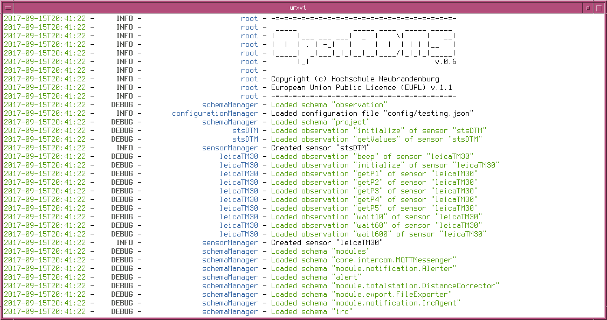

Running OpenADMS Node
=====================

OpenADMS can either be started from the command-line or by executing the
graphical launcher ``openadms-launcher.pyw``. The path to the configuration file
as well as additional options have to be set by using command-line arguments.

.. _openadms-launcher-screenshot:
.. figure:: _static/openadms_graphical_launcher.png
   :alt: Graphical launcher for OpenADMS
   :align: center
   :scale: 80%

   Graphical launcher for OpenADMS

Microsoft Windows
-----------------

Run ``cmd.exe`` or ``PowerShell.exe`` to start OpenADMS from command-line:

::

    > pipenv run openadms.py --config config\config.json --with-mqtt-broker

Press ``^C`` (``CTRL`` + ``C``) to stop OpenADMS Node.

Linux, Unix, and macOS
----------------------

Run OpenADMS Node from your terminal:

::

    $ pipenv run ./openadms.py --config config/config.json --with-mqtt-broker

Press ``^C`` (``CTRL`` + ``C``) to stop OpenADMS Node. A running instance of
OpenADMS can be restarted by sending a HUP signal:

::

    $ kill -s HUP $PID

``$PID`` is the process ID of the Python interpreter running OpenADMS Node.
The configuration will be re-read from file.

.. _openadms-freebsd:

   Running OpenADMS on FreeBSD

Android
-------

OpenADMS Node must be installed in ``qpython3/scripts3/openadms-node/``. Start
QPython3 and select “Programs” in the main menu. Change to directors
``openadms-node/`` and open ``android.py``. Change ``CONFIG_FILE_PATH`` to the
path of your OpenADMS Node configuration file. Save and run the file to start
OpenADMS Node.

Command-Line Arguments
----------------------

OpenADMS Node can be started with command-line arguments. The following ones will be accepted:

+------------------------+------------+------------------------+---------------------------+
| Argument               | Short form | Default value          | Description               |
+========================+============+========================+===========================+
| ``--config``           | ``-c``     | ``config/config.json`` | Path to the configuration |
|                        |            |                        | file.                     |
+------------------------+------------+------------------------+---------------------------+
| ``--debug``            | ``-d``     | off                    | Print debug messages.     |
+------------------------+------------+------------------------+---------------------------+
| ``--verbosity``        | ``-v``     | ``6`` (info)           | Log more diagnostic       |
|                        |            |                        | messages (level 1 to 9).  |
+------------------------+------------+------------------------+---------------------------+
| ``--log-file``         | ``-l``     | ``openadms.log``       | Path to the log file.     |
+------------------------+------------+------------------------+---------------------------+
| ``--with-mqtt-broker`` | ``-m``     | off                    | Start internal MQTT       |
|                        |            |                        | message broker.           |
+------------------------+------------+------------------------+---------------------------+
| ``--bind``             | ``-b``     | ``127.0.0.1``          | IP address or FQDN of     |
|                        |            |                        | internal MQTT message     |
|                        |            |                        | broker.                   |
+------------------------+------------+------------------------+---------------------------+
| ``--port``             | ``-p``     | ``1883``               | Port of internal MQTT     |
|                        |            |                        | message broker.           |
+------------------------+------------+------------------------+---------------------------+
| ``--quiet``            | ``-q``     | off                    | Disable logging to        |
|                        |            |                        | console.                  |
+------------------------+------------+------------------------+---------------------------+

Available verbosity levels for the ``--verbosity`` parameter:

+-------+----------+
| Level | Name     |
+=======+==========+
| 1     | critical |
+-------+----------+
| 2     | error    |
+-------+----------+
| 3     | success  |
+-------+----------+
| 4     | warning  |
+-------+----------+
| 5     | notice   |
+-------+----------+
| 6     | info     |
+-------+----------+
| 7     | verbose  |
+-------+----------+
| 8     | debug    |
+-------+----------+
| 9     | spam     |
+-------+----------+

The higher the level, the more log messages will be outputted.
